# [K-Shield 주니어 기초과정] 학습 Day2
# 02. Linux 기본 명령어 학습 및 실습

> **작성일자**: 2026-09-22
> **학습 주제**: Linux 기본 명령어 학습 및 실습
> **실습 환경**: VMware Workstation, Rocky Linux 10.x

---

## 1. 학습 목표 및 요약
* Linux의 기본 명령어들과 각 옵션들을 학습하고 주요 특징을 이해한다.
* 학습한 명령어들을 직접 실습해보며 실행 구조를 이해한다.

--- 

## 2. 학습한 명령어 및 핵심 실습

 

### 2-1. 시스템 종료 및 재시작
1. 시스템 즉시 종료
* shutdown -h now
* halt
* init 0 (자주 사용됨)

 

2. 즉시 재시작
* shutdown -r now
* reboot
* init 6 (자주 사용됨)

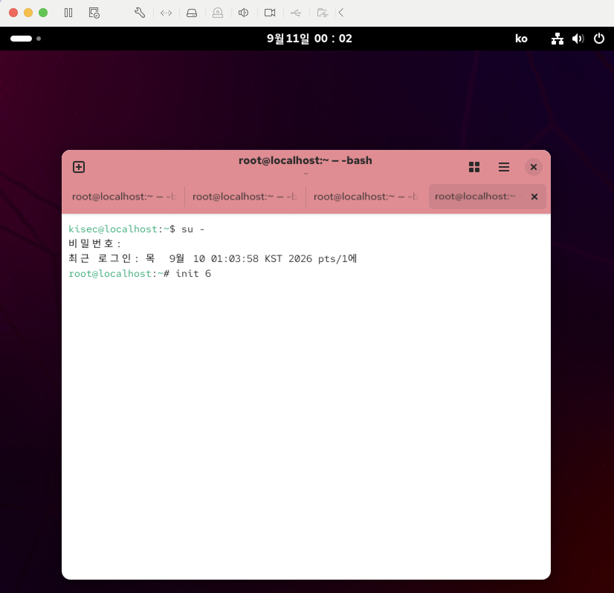
.png)

 
 

### 2-2. 파일 및 디렉터리 목록 보기 (ls)
1. ls 명령어 : 현재 디렉터리 파일의 목록을 표시한다.

 

2. ls 명령어의 추가 옵션
* -a : 디렉터리 내의 모든 파일 출력 
* -l : 파일 정보를 표시
* -s : 블록 단위로 파일 크기 표시
* -t : 파일 최근 변경 시간에 따라 정렬해서 출력
* -R : 현재 작업 디렉터리와 하위 디렉터리 모두 출력
* \* : 모든 디렉터리와 그 하위 디렉터리 모두 출력

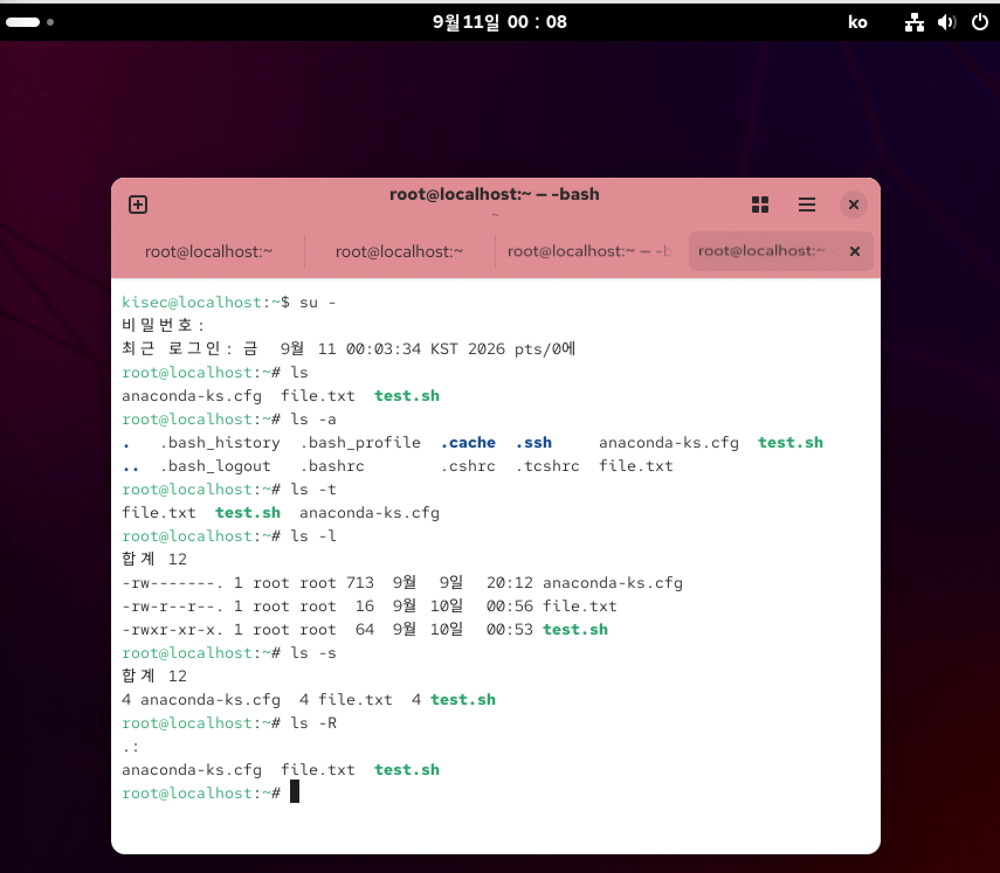

 
 

### 2-3. 현재 디렉터리 이름 출력 (pwd) 및 현재 디렉터리 변경 (cd)
1. pwd 명령어 : print name of working directory의 약어로, 작업중인 디렉터리의 이름을 출력한다. 현재 위치해 있는 디렉터리 위치를 알고자 할 때 쓰인다.

 

2. cd 명령어 : chage directory의 약어로, 상대경로와 절대경로를 이용하여 현 디렉터리 주소를 변경할 수 있다.

 

* 절대 경로 이용 예시 : 최상위(루트) 디렉터리부터 변경할 디렉터리까지 모두 입력하여 변경한다. [ cd /home/user/Desktop ]
* 상대 경로 이용 예시 : 현재 디렉터리를 기준으로 입력하여 변경한다. [ cd ./user/Desktop ]
* 절대경로는 /로 시작하고, 상대경로는 .또는 파일 이름으로 시작한다.

 

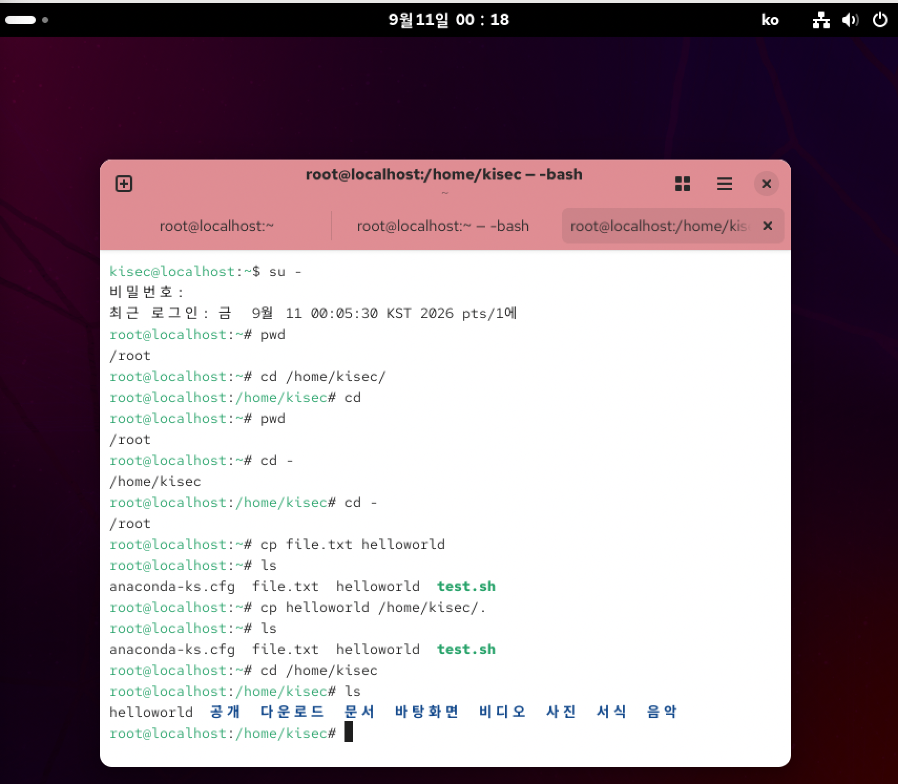

 
 

### 2-4. 파일 혹은 디렉터리 복사 (cp)
1. cp 명령어 : 파일 혹은 디렉터리를 복사하며, 원하는 경로 없이 복사할 경우 현재 경로에 자동으로 복사한다.

 

< cp 사용법 >
* cp [옵션] [원본파일] [원하는 경로 및 파일명(확장자)]
* cp [옵션] [원본 디렉터리] [원하는 경로 및 디렉터리명]

 

< cp 추가 옵션 >
* -a : 원본 파일의 속성, 링크 정보들을 유지하면서 복사
* -r : 디렉터리를 복사하되, 하위 디렉터리들까지 모두 복사 ( 디렉터리를 그냥 복사할 경우 에러가 나므로, -r 옵션을 같이 주어야 한다. )

 
 

### 2-5. 파일 삭제 (rm)
1. rm 명령어 : 필요 없는 파일을 삭제할 때 사용한다.
* 사용법 : rm [옵션] [파일명]

 

< rm 옵션 >
* -r : 하위 디렉터리를 포함한 파일들을 모두 삭제
* -f : 삭제할 것인가라는 메시지 없이 그대로 강제 삭제

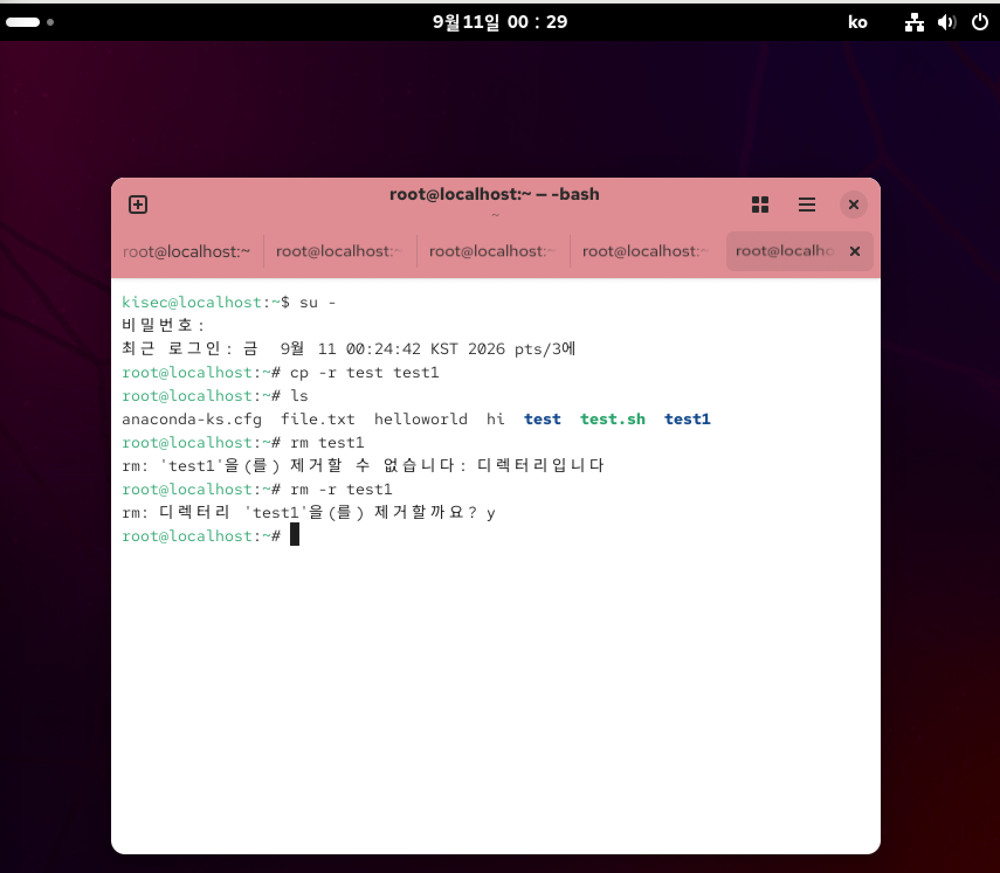

 
 

### 2-6. 디렉터리 생성 (mkdir) 및 삭제 (rmdir)
1. mkdir 명령어 : 새로운 디렉터리를 신규 생성 또는 추가로 생성.
< 사용법 > : mkdir [옵션] 생성 디렉터리 이름 (복수 지정 가능)

 

2. rmdir 명령어 : mkdir에 의해 생성된 디렉터리를 삭제. (디렉터리가 비어있을 경우에만 삭제가 가능하다.)
< 사용법 > : rmdir [옵션] 디렉터리 (복수 지정 가능)

 
 

### 2-7. 파일 이동 및 이름 변경 (mv)
1. mv 명령어 : 파일을 옮기거나 이름을 변경할 때 사용. 파일명을 지정하지 않을 경우 기존 파일명을 그대로 유지한다.

 

< 사용법 >
* 파일 이동 : mv [원본 파일] [이동하려는 경로 및 저장할 파일명]
* 이름 변경 : mv [원본 파일] [변경하려는 파일명]

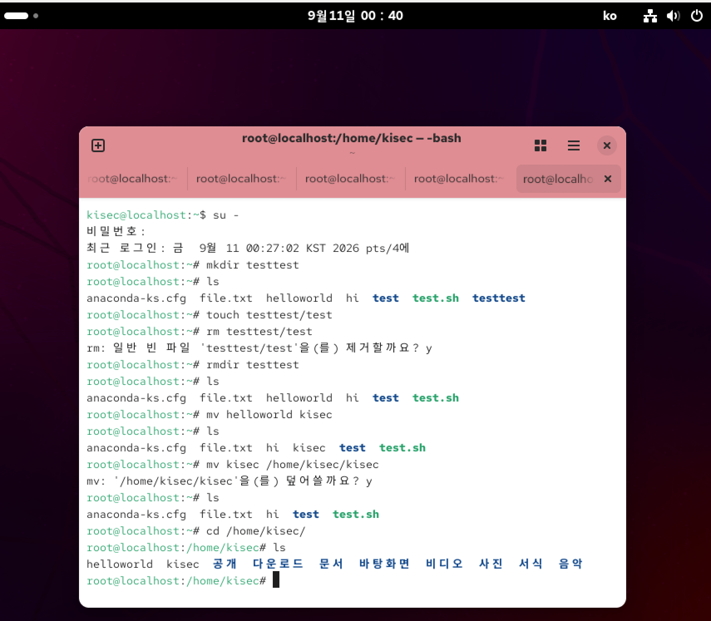

 
 

### 2-8. 파일 찾기 (find)
1. find 명령어 : 조건에 맞는 파일을 찾아주는 명령어. 기본적으로 하위 디렉터리까지 모두 탐색하며, 파일의 이름부터 수정시간에 이르기까지 주어진 파라미터들과 일치하는 파일을 찾아준다.
< 사용법 > : find [경로] [표현식] [지정 조건]

 

< 표현식 >
* -name : 지정된 문자열 패턴에 해당하는 파일 검색
* -exec : 검색된 파일에 대해 지정된 명령 실행

 

* 사용 예시 : find / -name "test" -> 파일 이름이 test인 파일을 모두 찾는다는 뜻이다. 만약, 파일 이름에 test가 들어간 파일을 모두 찾고 싶을 경우, "\*test\*" 라고 쓰면 된다.

 

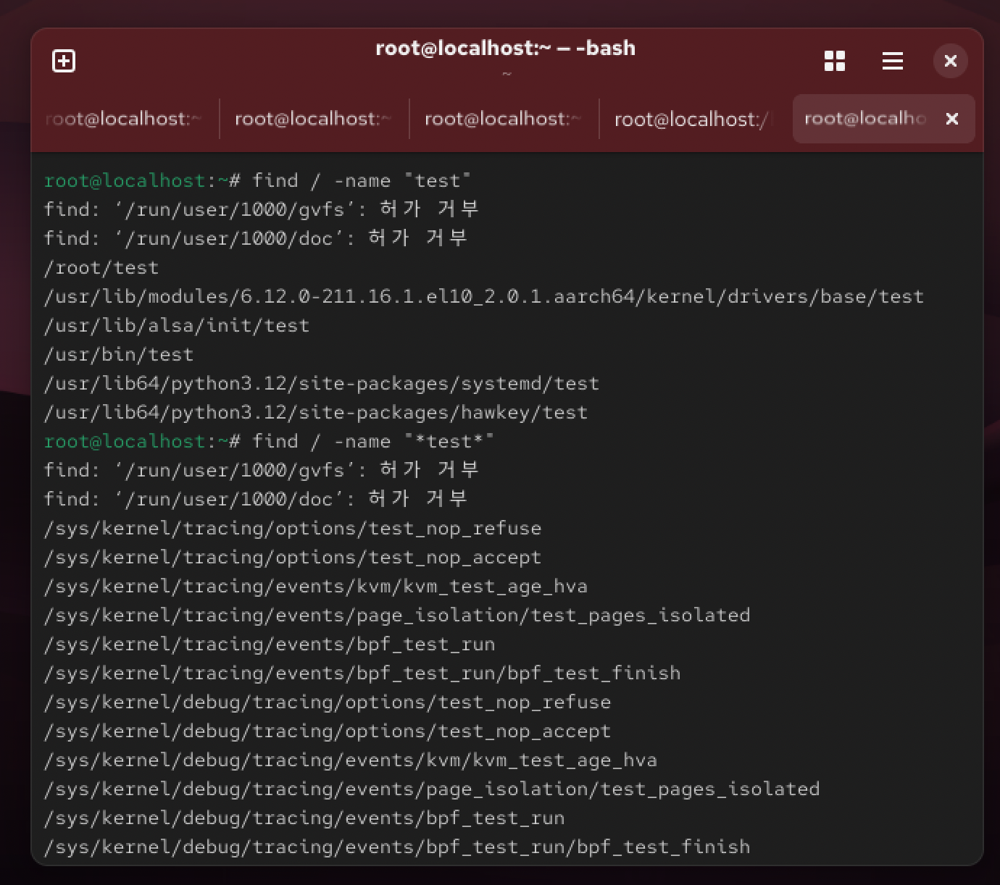

 
 

### 2-9. 프로세스 상태 확인 (ps)
1. ps 명령어 : process status의 약어로, 현재 사용하고 있는 프로세스의 상태를 점검.
< 사용법 > : ps [옵션]

 

< ps 옵션 >
* -ef : 표준 구문으로 시스템의 모든 프로세스 표시
* -u : 실행한 유저와 실행 시간을 표시
* -a : 다른 유저의 프로세스 현황 표시
* -x : 터미널 제어 없이 프로세스 현황 표시

 

< ps 사용시 알아둘 것 >
* UID : 유저 ID
* PID : 프로세스 ID (1번)
* PPID : 부모 프로세스 ID (0번)
* swaper : 부팅 시 swaper가 init 또는 systemd를 실행시킨다.

 

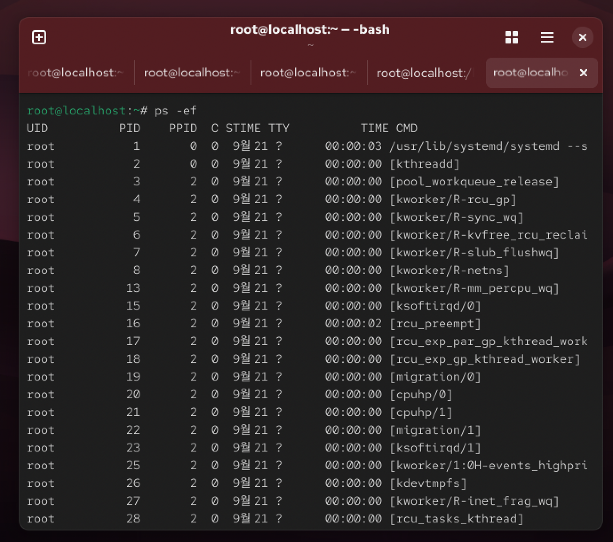

 
 

### 2-10. 시스템 사용자 확인 (who)
1. who 명령어 : 시스템 사용자를 확인하는 명령어.
< 사용법 > : who [옵션]

 

2. w 명령어 : who와 관련된 명령어로, who와 유사한 정보를 제공해주지만 추가적으로 데이터와 통계자료도 보여준다.

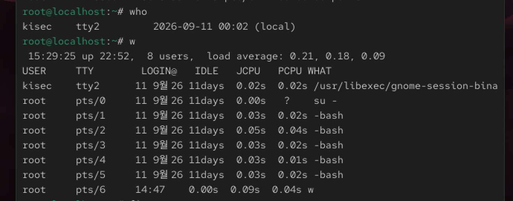

 
 

### 2-11. 프로세스 종료 (kill)
1. kill 명령어 : 시스템에 문제가 생겼을 때, 해당 프로세스를 강제로 종료하는 기능으로 유용하게 사용된다. 지정한 프로세스에 지정한 시그널을 보낸다.
< 사용법 > : kill [옵션(signal)] [PID]

 

< 옵션 (signal) >
* -l : 시그널 리스트 확인
* -9 : 프로세스를 강제로 종료

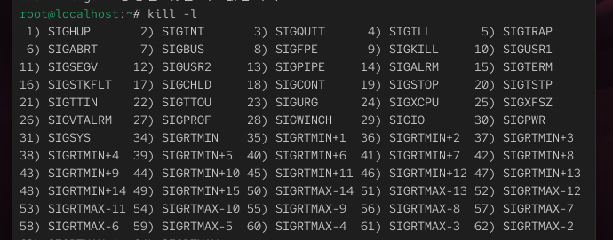
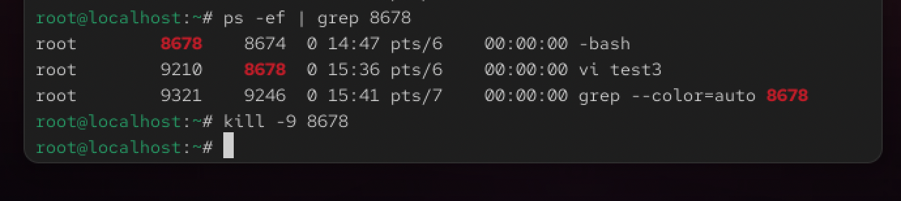
.png)

 
 

### 2-12. 파일 내용 출력 (cat)
1. cat 명령어 : concate의 약어로, 하나 이상의 파일의 이름을 인자로 받아서 터미널에 내용을 그대로 출력한다. 특정 파일의 내용을 빠르게 미리보기 하고자 할 때 자주 사용된다.

< 사용법 > : cat [옵션] [파일명]

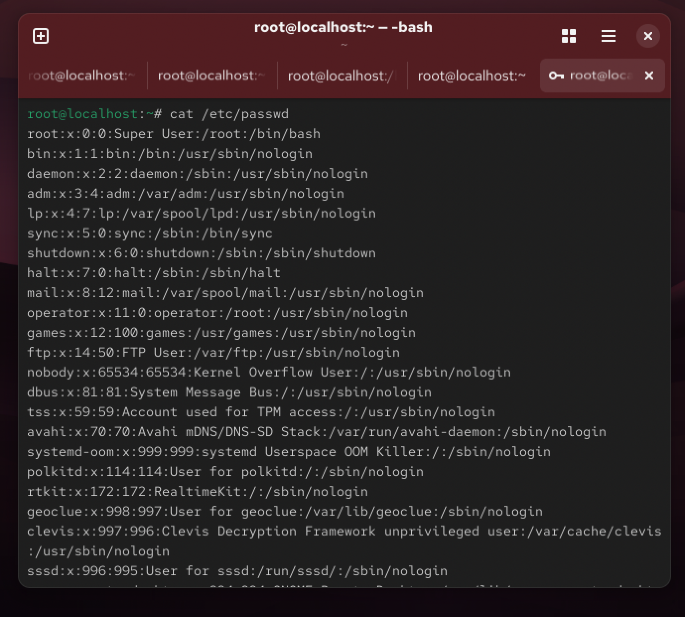

 
 

### 2-13. 파일, 명령 결과 내 특정 패턴 검색 (grep)
1. grep 명령어 : 해당 문자열이 들어있는 파일을 찾아 그 문자열이 들어가 있는 라인을 화면에 출력함. 보통 한 개 이상의 명령어와 파이프 라인을 사용해 같이 쓰는 경우가 많음.
< 사용법 > : grep [옵션] [표현 파일명 혹은 문자열]

 

< grep 옵션 > : -v ( 일치되는 내용이 없는 라인을 표시함 )

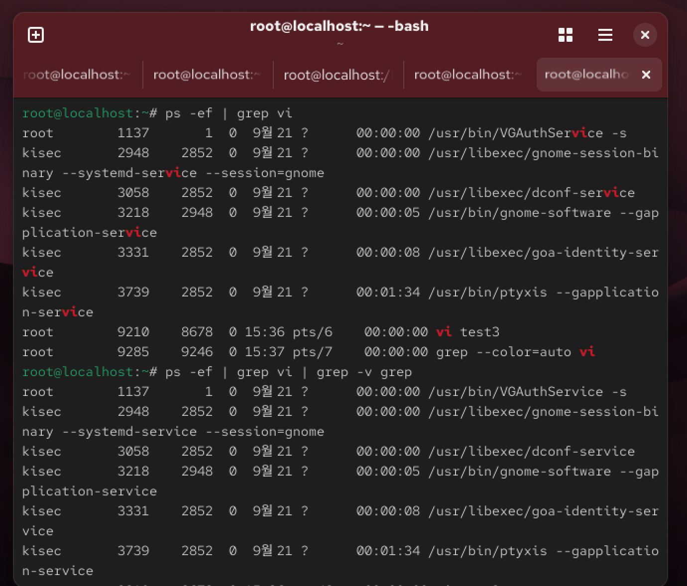
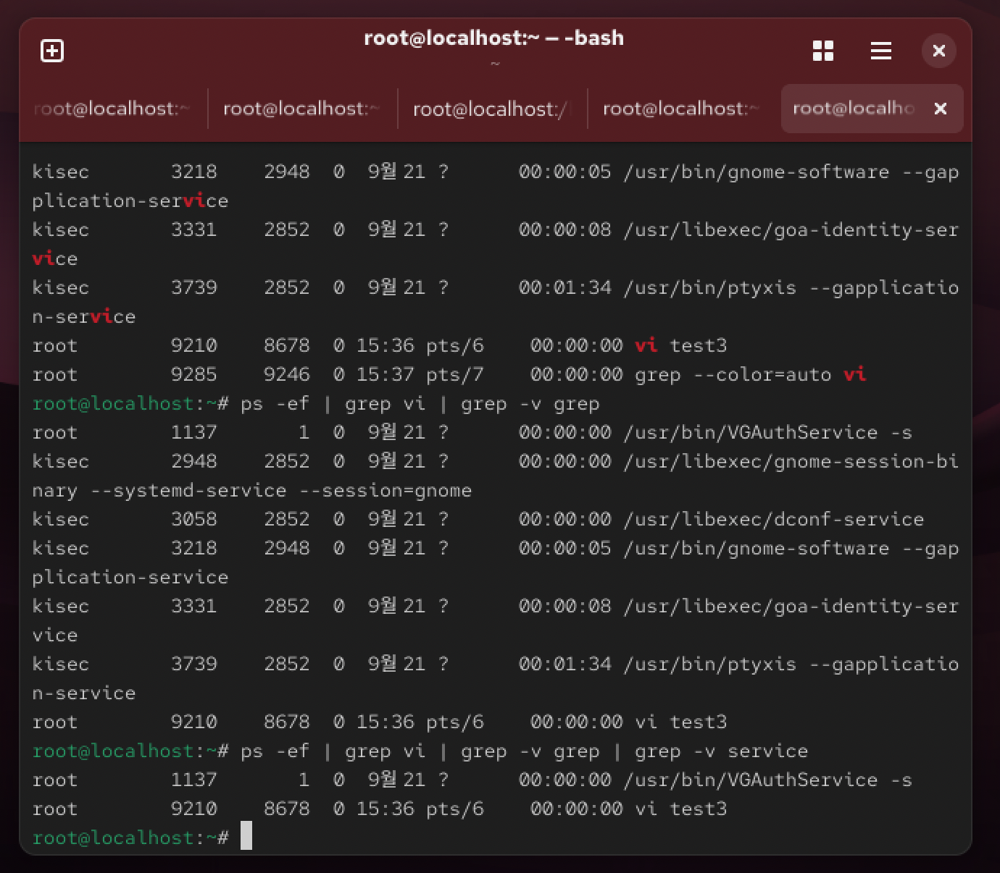
.png)
+PPID.png)

 
 

### 2-14. 긴 내용의 파일 내용, 명령 결과 확인 (more)
1. more 명령어 : 파일을 읽어 화면에 화면 단위로 출력. 긴 내용을 나누어 확인할 수 있는 장점이 있음. 한 개 이상의 명령어와 파이프 라인을 사용해 같이 많이 씀. ( 별도 단축키로 조작 가능 )

 

< 사용법 >
* more [옵션] [파일명]
* [명령어] | more

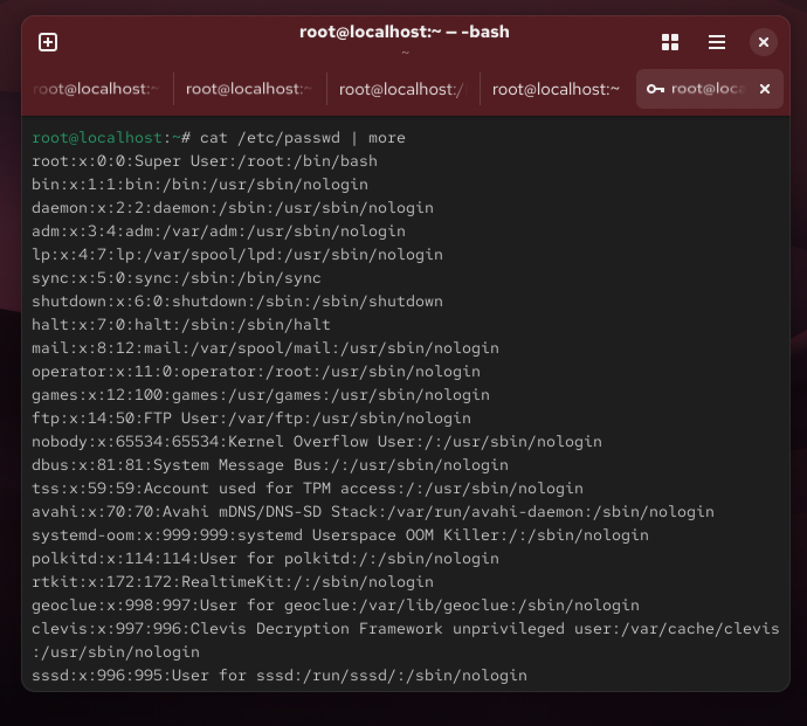
.png)

 
 

### 2-15. 이전 명령어 목록 보기 및 실행 (history)
1. history 명령어 : 이전 명령어를 볼 수 있다. 이전 명령어들이 저장되는 위치는 계정 별 홈 디렉터리의 .bash_history 파일이다. 이곳에 정상적으로 종료된 터미널에서 내렸던 명령어들이 저장된다.

 

< 사용법 >
* history
* history [옵션]
* history 7

 

2. history 확장 기능

 

< 표현식 >
* !! : 가장 최근에 사용한 명령 실행
* ![n] : history list에서 n번째 명령 실행
* ![string] : history list에서 입력한 string값이 존재하는 명령 실행

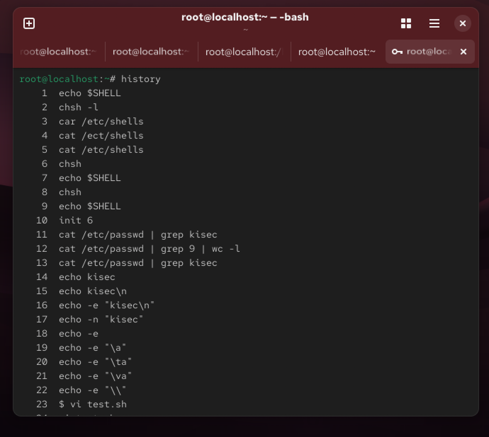
.png)
.png)

 
 

### 2-16. 디스크 용량 (df) 및 정보 (du) 확인
1. df 명령어 : 하드 디스크의 용량 확인
< 사용법 > : df [옵션]
< df 옵션 > : -h ( 보기 쉬운 용량 단위로 표시됨 )

 

2. du 명령어 : 사용한 디스크 용량에 대한 정보를 제공
< 사용법 > : du [옵션]

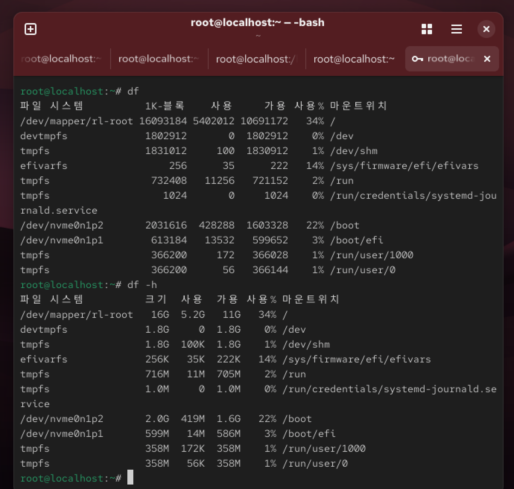
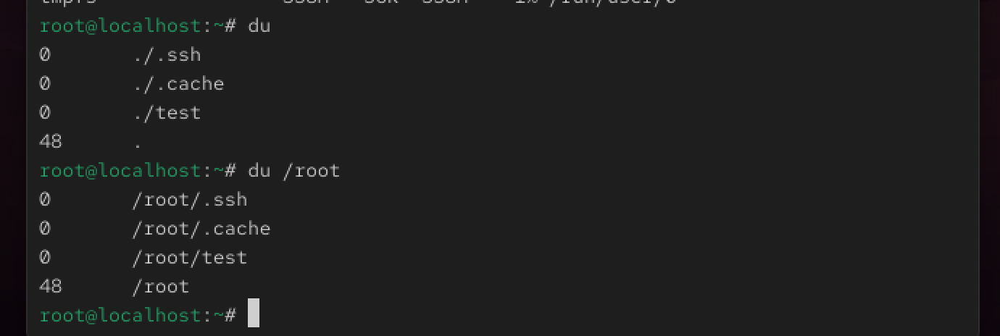

 
 

### 2-17. 명령어 메뉴얼 보기 (man)
1. man 명령어 : 리눅스 명령어의 도움말, 사용법, 각종 옵션, 사용 환경, 버그, 제작자 등을 확인할 수 있다.
< 사용법 > : man [확인할 명령어]

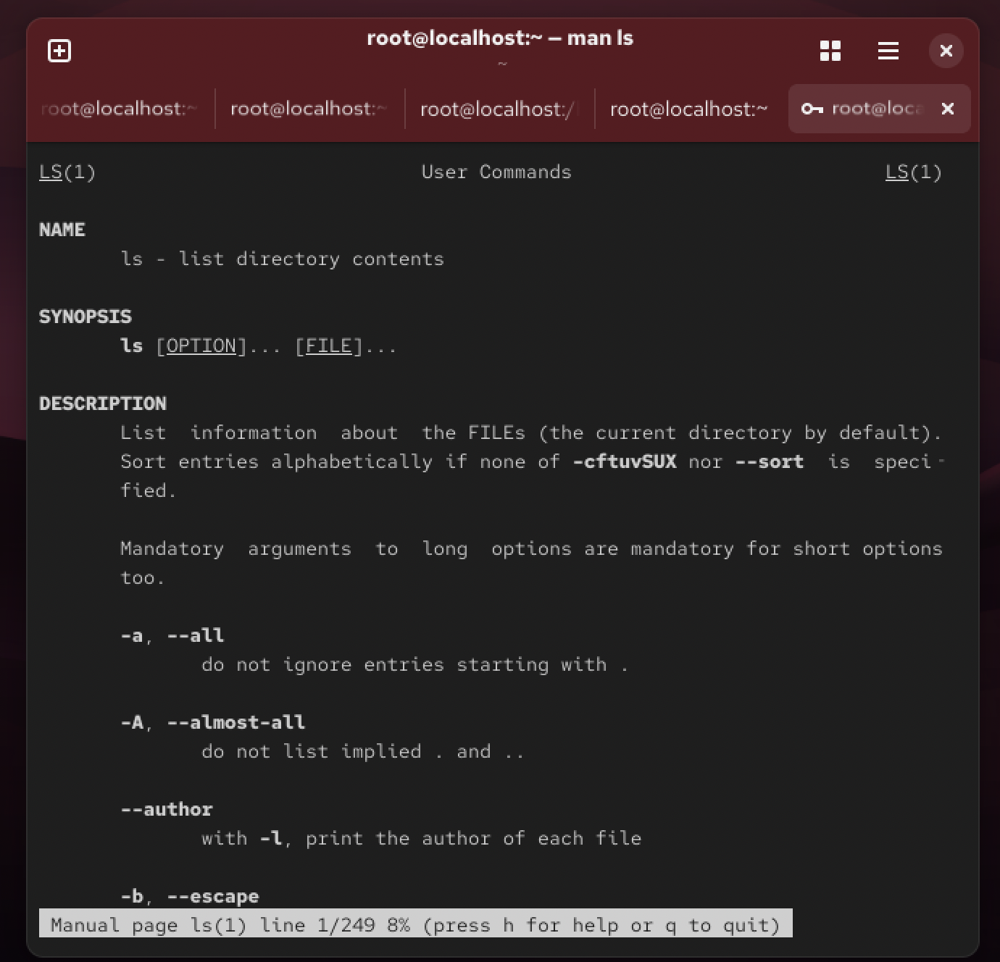

---
