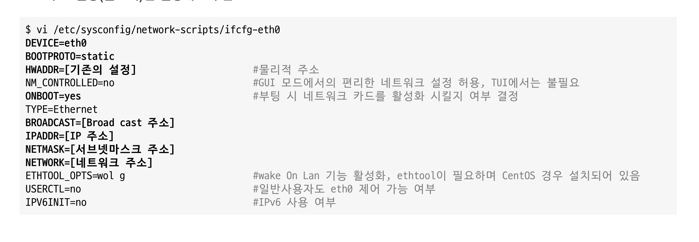
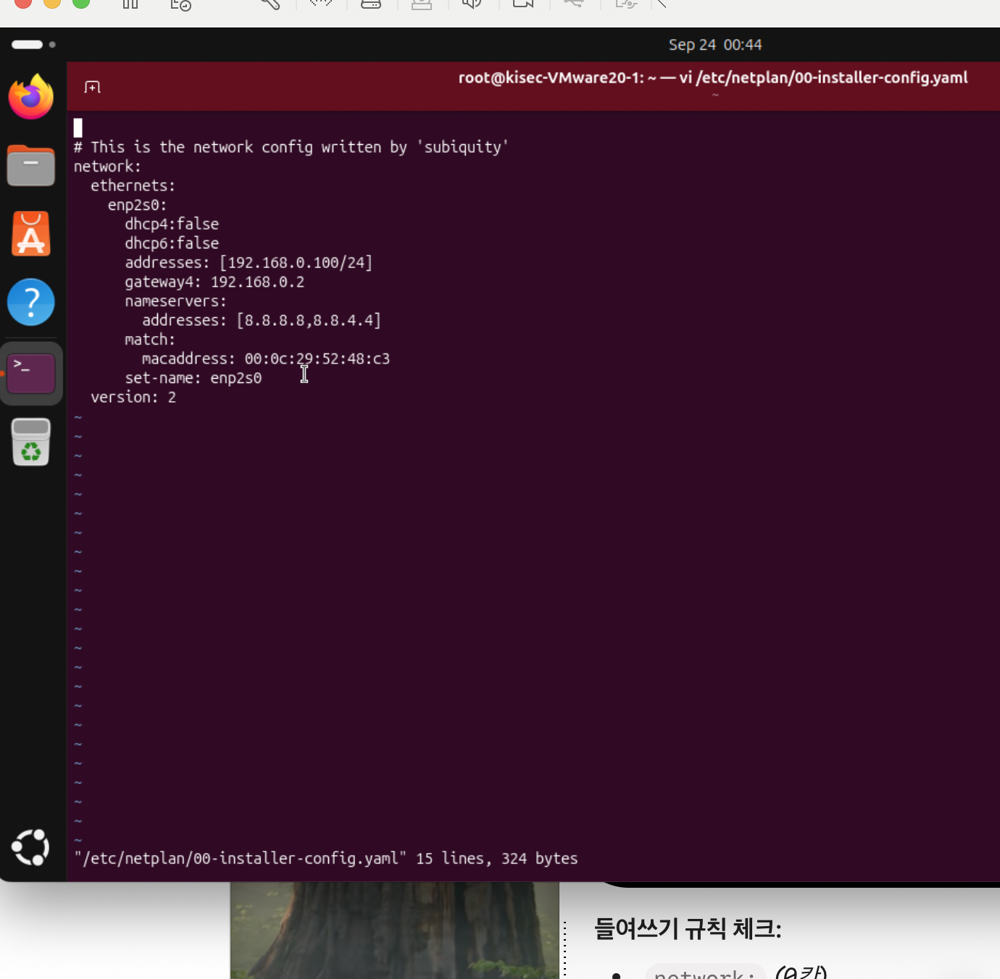
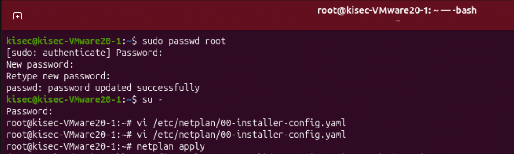

# [K-Shield 주니어 기초과정] 학습 Day4
# 03. 네트워크 구성

> **작성일자**: 2026-09-26
> **학습 주제**: 네트워크 구성의 이해
> **실습 환경**: VMware Workstation, Ubuntu

---

## 1. 학습 목표 및 요약
* 네트워크 구성을 이해하고, 설정 파일 변환을 통한 네트워크 세팅을 학습한다.
* 네트워크 NIC 카드의 설정 정보를 수정/확인하는 실습을 한다.

--- 

## 2. 학습 내용

### 2-1. 네트워크 구성 방안
1. 특정 범위 내의 IP 주소 대역대에서 중복되지 않은 IP 주소를 지정한다.

<br>

2. 인터넷을 사용하기 위해 게이트웨이의 IP 주소를 NAT Device의 주소인 192.168.0.2로 구성한다.

<br>

3. 영문으로 된 URL을 IP로 변경시켜주는 DNS 서버의 IP 주소를 구성한다.

<br>

### 2-2. 네트워크 파일 형태 구성
1. 리눅스 운영체제는 디바이스 형태를 포함하여 모두 파일로 구성되어 있기 때문에, 네트워크도 파일 형태로 구성해주어야 한다.

<br>

2. 네트워크 설정 파일 (CentOS 6.9 기준) : 네트워크 NIC 카드의 설정 정보를 수정 또는 확인
[ /etc/sysconfig/network-script/ifcfg-[ 네트워크 인터페이스명 ] ]

<br>

3. 네트워크의 전체 기본 게이트웨이 주소를 설정, 호스트 네임, 네트워크 연결 허용 여부 설정 및 확인
[ /etc/sysconfig/network ]

<br>

### 2-3. 설정 파일 변환을 통한 네트워크 세팅
1. 아래와 같이 설정 파일을 수정함으로서 네트워크를 세팅할 수 있다. 또한 특정 설정값을 수정하여 서비스를 재실행 해야하는 경우도 간혹 발생한다.

* IP 및 기타 설정을 고정으로 설정하려는 경우 아래와 같이 설정하며, 환경에 따라 변형하여 설정한다. (주요 설정(볼드체)만 설정해도 무관하다.)



* BOOTPROTO : NIC를 수동/자동으로 잡을 것인지를 설정하는 것이다. static이면 고정 IP 할당, DHCP면 자동 IP 할당이다. 

<br>

### 2-4. DNS 서버 설정

1. DNS 서버 설정 

```bash
vi /etc/resolv.conf 
```

<br>

2. 다음과 같이 수정한다.

```bash
search localdomain
nameserver 168.126.63.1
nameserver 168.126.63.2
```
<br>

3. 또는 설정에 따라 /etc/ifcfg-eth0에 설정에서 아래와 같이 수정한다.

```bash
$ vi /etc/sysconfig/nerwork-scripts/ifcfg-eth0
BOTOPROTO=static
GATEWAY=192.168.0.2
TYPE=Eternet
DNS1=168.126.63.1
DNS2=168.126.63.2
```
<br>

4. 네트워크 서비스 재시작 : 전체적인 네트워크를 건드리지 않고 특정 디바이스에 대해서만 재시작할 때 사용한다.

```bash
$ sudo /etc/init.d/network restart
```

* ex) ifdown ens33, ifup ens33 : ens33이라는 NIC만 재시작


<br>

### 2-5. 명령어를 이용한 네트워크 세팅

* 명령어를 통한 네트워크 설정 방법은 일시적으로 등록되는 사항일 뿐, 재부팅 시 초기화되는 현상이 발생하므로 유지보수를 위한 좋은 방법은 아니다.
* 그렇기 떄문에 거의 test용으로만 쓰인다.

<br>

### 2-6. 네트워크 설정 확인하기

1. ifconfig를 통해 IP, 물리적 주소, 브로드캐스트, 서브넷마스크 등 네트워크 카드 정보를 확인할 수 있다.
* 리눅스에서는 ifconfig이고, 윈도우에서는 ipconfig이다.

```bash
$ ifconfig
```

<br>

2. route -n을 통해 글로벌 주소 또는 게이트웨이 주소를 확인할 수 있다.


```bash
$ route -n
```

<br>

3. nslookup을 통해 DNS 설정 값을 확인할 수 있다.


```bash
$ nslookup
$ > server
```

<br>

### 2-7. 네트워크 구간 별 오류 확인 방법
* 각 구간에 맞는 연결 방식을 이해하고, 어떤 구역이 잘못 연결되었는지 판단해야 하며, 시스템이 잘 구동되어 있는지 확인하고자 할 떄는 ping 명령어(ICMP)를 통해 확인해야 한다.

<br>

1. 공유기에 문제가 있는 경우
* 공유기 문제의 경우 게이트웨이 주소로의 통신이 되지 않아 route -n을 통한 게이트웨이 확인, 또는 ifconfig 명령어를 통한 IP 주소 확인이 필요하다.

```bash
$ ping [게이트웨이 주소]
```

<br>

2. 웹사이트 접속이 안되는 경우
* 게이트웨이로의 연결이 정상이라면, 도메인 서버 설정이 잘못되어 있거나 인터넷이 되지 않을 가능성이 존재하며, DNS 연결 확인과 외부 인터넷 가능 여부를 확인한다.

```bash
$ ping [DNS 서버 주소]
$ nslookup
$ > server
```

### 3. Ubuntu를 통한 네트워크 설정 실습

1. root 계정 활성화 명령어

```bash
$ sudo passwd root
```

<br>

2. 네트워크 설정 작성

```bash
$ vi /etc/netplan/00-installer-config.yaml
```

<br>

3. 네트워크 구성 작성

```bash
$ network:
    eternets:
        ens33:
            dhcp4: false
            address: [192.168.0.100/24]
            gateway4: 192.168.0.2
            nameservers :
                address: [ 8.8.8.8, 8.8.4.4 ]
    version: 2
```

<br>

4. netpaln apply 명령을 통해 설정 확인

```bash
$ netpaln apply
```


