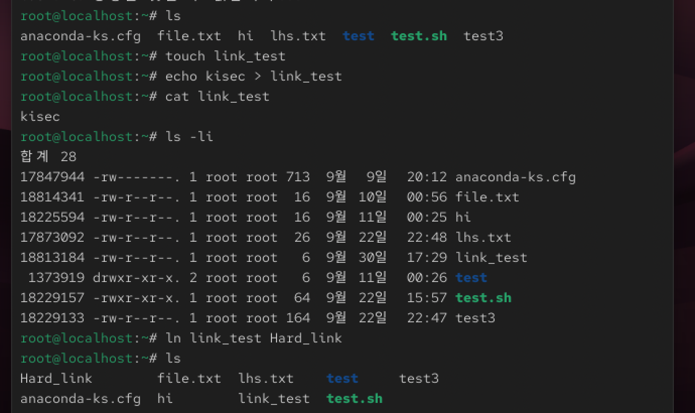
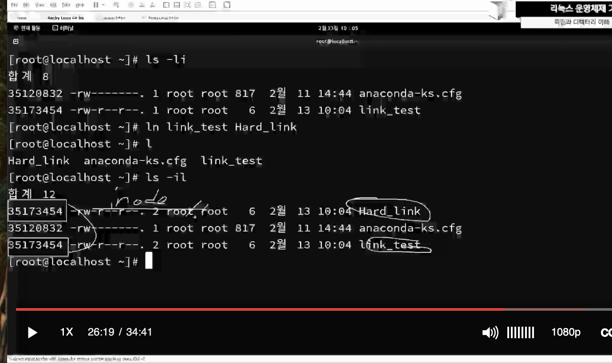

# [K-Shield 주니어 기초과정] 학습 Day5
# 05. 네트워크 구성

> **작성일자**: 2026-09-30
> **학습 주제**: 파일과 디렉터리 이해
> **실습 환경**: VMware Workstation, Rocky Linux 10.x

---

## 1. 학습 목표 및 요약
* 파일과 디렉터리를 이해하고, 파일의 구조와 종류들을 학습한다.
* 링크파일에 대해 실습한다.

--- 

## 2. 학습 내용

### 2-1. 모든 것은 파일

1. 리눅스의 파일 시스템 : 리눅스 파일 시스템은 파일과 디렉터리의 계층적 구조를 가지고 있다.

<br>

2. 모든 것은 파일(Everything is a file) : UNIX에서 유래된 리눅스의 모토이다.

<br>

3. 일반파일, 디렉터리 파일, 특수파일(블록 장치 파일, 캐릭터 장치 파일, 심볼릭 링크 파일 등) 로 나뉜다.

<br>

### 2-2. 트리구조
1. 리눅스 파일 시스템은 파일과 디렉터리의 계층적 구조를 가지고 있으며, 보통은 서로 연관된 파일들을 하나의 그룹으로 모으고 각 그룹을 고유의 디렉터리에 보관한다.

<br>

2. 이 계층 구조의 기초에는 루트 디렉터리가 있고, ' / ( 슬래쉬 ) '로 나타낸다.

<br>

3. 모든 파일과 디렉터리는 루트 디렉터리의 자식 혹은 먼 후손 관계이다.

<br>

4. 루트 디렉터리 아래에는 bin, boot, dev, etc, mnt, home, lib, proc, root, sbin, tmp, usr, var 디렉터리들이 있다.

<br>

### 2-3. 파일 종류
1. ls -l 명령어를 수행했을 때 출력 되는 파일 구조를 보면 맨 앞자리의 문자에 따라 파일 종류를 알 수 있다.
* \- : 일반 정규 파일
* d : 디렉터리 파일
* b : 블록 디바이스 ( /dev/hda, /dev/sda, /dev/fd0 )
* c : 문자 디바이스 ( 입출력 장치 )
* | : 링크되어 있는 파일
* s : 소켓 기능을 하는 파일
* p : 파이프 기능을 수행하는 파일

<br>

2. 일반 파일, 디렉터리, 링크 파일
* 일반파일 : 마이너스 ( - ) 기호로 시작. 실행파일, 스크립트, 이미지 파일, 텍스트 파일, 설정 파일, 압축 파일 등
* 디렉터리 : d로 시작, 최상위 디렉터리에서 ls 명령어를 입력하면 쉽게 확인 가능.
* 링크 파일 : 하나의 파일과 연결된 다른 이름의 파일. 하드링크( 같은 inode 번호를 가짐 )와 심볼릭 링크( 문자 1로 시작 )가 있음.

<br>

3. 디바이스 : 블록 디바이스와 문자 디바이스가 있다.
* 블록 디바이스 : b로 시작, 하드디스크나 플로피 디스크 디바이스 등
* 문자 디바이스 : c로 시작, 터미널 디바이스, 사운드카드, 마우스 프린터 등

<br>

4. Inode ( 아이노드 ) : 리눅스의 파일에 대한 모든 정보를 추적하는 데이터 구조이다. 리눅스 시스템은 파일에 접근할 때 파일의 이름이 아닌, 이름과 매핑되어있는 숫자로 접근하는데 이 숫자를 Inode number라고 한다.
\- 사용자가 정보를 파일에 저장 -> 운영체제는 파일에 대한 정보를 Inode에 저장한다.

<br>

5. 링크( Link ) 파일 : 하나의 파일 또는 디렉터리를 다른 이름으로 연결한다.
\- 파일 명이나 디렉터리 명이 길어 이를 단축하거나, 파일 위치 경로가 비 실행위치거나 매우 싶은 하위 디렉터리일 경우, 한 번에 이동하는 용도 등으로 사용된다. 
\- 하드링크, 심볼릭 링크 두 가지 유형으로 생성 가능하다.

<br>

6. 하드링크 ( Hard Link ) : ln 명령어로 원래의 파일을 다른 파일로 링크시킬 수 있다.
```bash
ln [옵션] 링크대상파일명 링크파일명
```
\- 링크하는 원본파일과 같은 inode 번호를 갖는다. 그러므로 파일 이름을 제외한 모든 것을 공유하기 때문에, 원본파일의 속성 등이 바뀌게 되면 링크된 쪽도 바뀌게 된다. 
\- 원본 파일이 사라져도 하드링크가 원본 데이터를 링크하고 있기 때문에 나머지 하드링크 파일들은 영향을 받지 않는다.


<br>

7. 심볼릭 링크 ( Symbolic Link ) : 가장 많이 쓰이는 링크 방법, C언어의 포인터와 비슷한 개념으로, 다른 파일을 참조하고 있는 파일이라고 할 수 있다.

```bash
ln -s 링크대상파일명 링크파일명
```

\- 하드링크와는 다르게, 심볼릭 링크 파일은 원본파일과 다른 inode 번호를 갖는다. 원본 데이터가 아닌 원본 파일을 링크하는 원본파일 포인터의 inode를 갖는다.
\- 그러므로 원본파일이 삭제되면 링크가 깨지게 된다.

<br>

### 2-4. 실습을 통한 파일 구조의 이해



